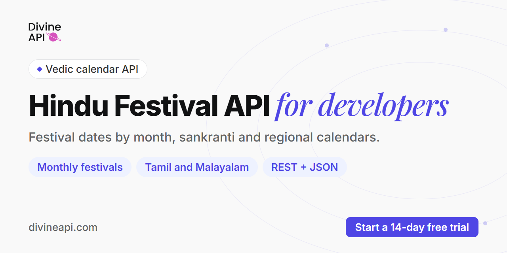

# Hindu Festival API by DivineAPI



The Hindu Festival API (a Hindu calendar API for festivals) returns festival dates for a year and place as JSON, with puja muhurat, vrat and parana (fast-breaking) times and a festival image. Query by Gregorian month, by Hindu lunar month (Chaitra to Phalguna), by date or by festival name, or get the sankranti, Tamil and Malayalam festival calendars.

[](https://developers.divineapi.com/indian-api/festival-api)
[](https://divineapi.com/start-trial)
[](https://documenter.getpostman.com/view/26759678/2sBYAysU8Y)
[](https://status.divineapi.com)
[](https://deepwiki.com/DivineAPI/hindu-festival-api)

Verified live against the DivineAPI API on 2 October 2026.

This repo is the developer quickstart for DivineAPI's **festival calendar** endpoints, part of the Vedic API (140+ endpoints). It answers "when is Karwa Chauth this year, and what is the puja time?". For the day-level almanac (tithi, nakshatra, choghadiya, Rahu kaal, muhurat finder) use the [Panchang API](https://github.com/DivineAPI/panchang-api).

---

## Quickstart (60 seconds)

**1. Get your keys.** Start the [14-day free trial](https://divineapi.com/start-trial) (credit card required to activate the trial), then copy your **API key** and **auth token** from the dashboard.

Every request is a `POST` with `multipart/form-data`, and needs both:

- header `Authorization: Bearer YOUR_AUTH_TOKEN`
- form field `api_key=YOUR_API_KEY`

Runnable files: [`examples/`](examples) (curl, Python, Node.js, PHP).

**2. curl**: all festivals in October 2026 for New Delhi

```bash
curl -s -X POST "https://astroapi-3.divineapi.com/indian-api/v1/english-calendar-festivals" \
  -H "Authorization: Bearer YOUR_AUTH_TOKEN" \
  -F "api_key=YOUR_API_KEY" \
  -F "year=2026" -F "month=10" \
  -F "place=new delhi" \
  -F "lat=28.6139" -F "lon=77.2090" -F "tzone=5.5"
```

**3. Python (requests)**

```python
import requests

URL = "https://astroapi-3.divineapi.com/indian-api/v1/english-calendar-festivals"
AUTH_TOKEN = "YOUR_AUTH_TOKEN"
API_KEY = "YOUR_API_KEY"

fields = {
    "api_key": API_KEY,
    "year": "2026", "month": "10",
    "place": "new delhi",
    "lat": "28.6139", "lon": "77.2090", "tzone": "5.5",
}
resp = requests.post(
    URL,
    headers={"Authorization": f"Bearer {AUTH_TOKEN}"},
    files={k: (None, v) for k, v in fields.items()},  # multipart/form-data
    timeout=60,
)
body = resp.json()
if body.get("success") != 1:  # legacy hosts return HTTP 200 even on errors
    raise SystemExit(f"API error: {body.get('msg')}")


def first_date(value):
    """Festival shapes vary: {date}, a list of days, or smartas/vaishnavas variants."""
    if isinstance(value, list):
        return first_date(value[0])
    if "date" in value:
        return value["date"]
    return first_date(next(iter(value.values())))


for key, value in body["data"].items():
    print(first_date(value), key)
```

Output (real run):

```text
2026-10-01 pitru_paksha
2026-10-03 jivit_putrika_vrat
2026-10-06 indira_ekadashi
2026-10-08 pradosha_vrat
2026-10-10 pitru_amavasya
2026-10-11 shardiya_navaratri
2026-10-15 upang_lalita_vrat
2026-10-20 vijayadashami
2026-10-20 kanya_pujan
2026-10-22 papankusha_ekadashi
2026-10-25 sharad_purnima
2026-10-25 kojagara_puja
2026-10-29 karwa_chauth
```

**Node.js (18+, built-in fetch)**

```javascript
const URL = "https://astroapi-3.divineapi.com/indian-api/v1/english-calendar-festivals";
const AUTH_TOKEN = "YOUR_AUTH_TOKEN";
const API_KEY = "YOUR_API_KEY";

const fields = {
  api_key: API_KEY,
  year: "2026", month: "10",
  place: "new delhi",
  lat: "28.6139", lon: "77.2090", tzone: "5.5",
};
const form = new FormData();
for (const [k, v] of Object.entries(fields)) form.append(k, v);

const res = await fetch(URL, {
  method: "POST",
  headers: { Authorization: `Bearer ${AUTH_TOKEN}` },
  body: form,
});
const body = await res.json();
if (body.success !== 1) throw new Error(`API error: ${JSON.stringify(body.msg)}`);

// Festival shapes vary: {date}, a list of days, or smartas/vaishnavas variants.
const firstDate = (v) =>
  Array.isArray(v) ? firstDate(v[0]) : v.date ?? firstDate(Object.values(v)[0]);

for (const [name, value] of Object.entries(body.data)) {
  console.log(firstDate(value), name);
}
```

Save it as `festivals.mjs` and run `node festivals.mjs` (top-level `await` needs an ES module).

**4. PHP (cURL)**

```php
<?php
$ch = curl_init("https://astroapi-3.divineapi.com/indian-api/v1/english-calendar-festivals");
curl_setopt_array($ch, [
    CURLOPT_POST           => true,
    CURLOPT_RETURNTRANSFER => true,
    CURLOPT_HTTPHEADER     => ["Authorization: Bearer YOUR_AUTH_TOKEN"],
    // An array (not a query string) makes cURL send multipart/form-data
    CURLOPT_POSTFIELDS     => [
        "api_key" => "YOUR_API_KEY",
        "year" => "2026", "month" => "10",
        "place" => "new delhi",
        "lat" => "28.6139", "lon" => "77.2090", "tzone" => "5.5",
    ],
]);
$body = json_decode(curl_exec($ch), true);
curl_close($ch);

if (($body["success"] ?? 0) !== 1) {
    exit("API error: " . json_encode($body["msg"] ?? $body));
}
foreach ($body["data"] as $festival => $value) {
    echo $festival . PHP_EOL;
}
```

---

## Example response

`POST /indian-api/v1/english-calendar-festivals` for October 2026 (real response, trimmed). Each key is a festival; the value carries the date and the timings that matter for that festival:

```json
{
  "success": 1,
  "data": {
    "pitru_paksha": [
      {
        "date": "2026-10-01",
        "tithi": { "tithi": "Shasthi", "paksha": "Krishna", "start_time": "2026-10-01 12:36:00", "end_time": "2026-10-02 10:15:00" },
        "kutup": { "start_time": "2026-10-01 11:50:01", "end_time": "2026-10-01 12:38:01" },
        "aparahna": { "start_time": "2026-10-01 13:26:01", "end_time": "2026-10-01 15:44:01" },
        ...
      },
      ...
    ],
    "indira_ekadashi": {
      "smartas": {
        "date": "2026-10-06",
        "parana": { "start_time": "2026-10-07 06:17:14", "end_time": "2026-10-07 08:38:14" },
        "image": "https://astroapi-6.divineapi.com/public/assets/vedic/festivals/images/main/Indira%20Ekadashi.png"
      },
      "vaishnavas": { "date": "2026-10-06", ... }
    },
    "shardiya_navaratri": {
      "pratipada": {
        "date": "2026-10-11",
        "puja": "Shailputri Puja",
        "ghatasthapana_abhijit_muhurat": { "start_time": "2026-10-11 11:44:45", "end_time": "2026-10-11 12:31:13" },
        ...
      },
      ...
    },
    "vijayadashami": {
      "date": "2026-10-20",
      "vijay_muhurta": { "start_time": "2026-10-20 13:59:34", "end_time": "2026-10-20 14:45:02" },
      "aparahna_puja_time": { "start_time": "2026-10-20 13:13:54", "end_time": "2026-10-20 15:30:54" },
      "image": "https://astroapi-6.divineapi.com/public/assets/vedic/festivals/images/main/Vijayadashami.png"
    },
    "karwa_chauth": {
      "date": "2026-10-29",
      "vrat_timings": { "start_time": "2026-10-29 06:30:52", "end_time": "2026-10-29 20:07:58" },
      "puja_timings": { "start_time": "2026-10-29 17:38:33", "end_time": "2026-10-29 18:55:51" },
      "moonrise": "2026-10-29 20:07:58",
      "image": "https://astroapi-6.divineapi.com/public/assets/vedic/festivals/images/main/Karwa%20Chauth.png"
    },
    ...
  }
}
```

**Sankranti** `POST /indian-api/v1/sankranti-festivals` for 2026 returns the 12 sankrantis plus regional new-year and harvest days (Lohri, Pongal, Vaisakhi, Vishu, Puthandu, Pohela Boishakh and others):

```json
{
  "success": 1,
  "data": {
    "year": 2026,
    "makar_sankranti": {
      "date": "2026-01-14",
      "sankranti_moment": "2026-01-14 15:08:00",
      "punya_kala": { "start_time": "2026-01-14 15:08:00", "end_time": "2026-01-14 17:45:21" },
      "maha_punya_kala": { "start_time": "2026-01-14 15:08:00", "end_time": "2026-01-14 16:53:00" },
      "image": "https://astroapi-6.divineapi.com/public/assets/vedic/festivals/images/main/Makar%20Sankranti.png"
    },
    ...
  }
}
```

**Festival by name** `POST /indian-api/v1/find-festival` with `festival=deepawali`:

```json
{
  "success": 1,
  "data": {
    "date": "2026-11-08",
    "puja_muhurat": { "start_time": "2026-11-08 17:55:00", "end_time": "2026-11-08 19:50:00" },
    "nishita_muhurat": { "start_time": "2026-11-08 23:42:19", "end_time": "2026-11-09 00:35:19" },
    "auspicious_choghadiya": [ ... ],
    ...
  }
}
```

---

## What you can build

- A Hindu festival calendar page or app, month by month, with festival images.
- Vrat reminders: Ekadashi with parana times, Pradosha, Karwa Chauth with moonrise.
- "Upcoming festivals" widgets for temple, puja-booking or e-commerce sites.
- Regional calendars for Tamil Nadu and Kerala audiences (Tamil and Malayalam festival endpoints).
- A sankranti and harvest-festival feed (Makar Sankranti, Pongal, Lohri, Vishu, Vaisakhi).

---

## Endpoints

All festival endpoints are on host **`https://astroapi-3.divineapi.com`**. Each row links to its docs page.

### By Gregorian date

| Endpoint | Path | Input | Docs |
|---|---|---|---|
| Festivals in a Gregorian month | `/indian-api/v1/english-calendar-festivals` | year, month | [docs](https://developers.divineapi.com/indian-api/festival-api/english-calendar-specific) |
| Festivals on a date | `/indian-api/v1/date-specific-festivals` | year, month, day | [docs](https://developers.divineapi.com/indian-api/festival-api/date-specific-festivals) |
| One festival by name | `/indian-api/v1/find-festival` | year, festival | [docs](https://developers.divineapi.com/indian-api/festival-api/festival-specific) |

### By Hindu lunar month (input: year)

| Lunar month | Path | Docs |
|---|---|---|
| Chaitra | `/indian-api/v2/chaitra-festivals` | [docs](https://developers.divineapi.com/indian-api/festival-api/hindu-calendar-specific/find-chaitra-festivals) |
| Vaishakha | `/indian-api/v2/vaishakha-festivals` | [docs](https://developers.divineapi.com/indian-api/festival-api/hindu-calendar-specific/find-vaishakha-festivals) |
| Jyeshtha | `/indian-api/v2/jyeshtha-festivals` | [docs](https://developers.divineapi.com/indian-api/festival-api/hindu-calendar-specific/find-jyeshtha-festivals) |
| Ashadha | `/indian-api/v2/ashada-festivals` | [docs](https://developers.divineapi.com/indian-api/festival-api/hindu-calendar-specific/find-ashadha-festivals) |
| Shravana | `/indian-api/v2/shraavana-festivals` | [docs](https://developers.divineapi.com/indian-api/festival-api/hindu-calendar-specific/find-shravana-festivals) |
| Bhadrapada | `/indian-api/v2/bhadrapada-festivals` | [docs](https://developers.divineapi.com/indian-api/festival-api/hindu-calendar-specific/find-bhadrapada-festivals) |
| Ashwin | `/indian-api/v2/ashvina-festivals` | [docs](https://developers.divineapi.com/indian-api/festival-api/hindu-calendar-specific/find-ashwin-festivals) |
| Kartik | `/indian-api/v2/kartika-festivals` | [docs](https://developers.divineapi.com/indian-api/festival-api/hindu-calendar-specific/find-kartik-festivals) |
| Margashirsha | `/indian-api/v2/margashirsh-festivals` | [docs](https://developers.divineapi.com/indian-api/festival-api/hindu-calendar-specific/find-margashirsha-festivals) |
| Paush | `/indian-api/v2/pausha-festivals` | [docs](https://developers.divineapi.com/indian-api/festival-api/hindu-calendar-specific/find-paush-festivals) |
| Magha | `/indian-api/v2/magha-festivals` | [docs](https://developers.divineapi.com/indian-api/festival-api/hindu-calendar-specific/find-magha-festivals) |
| Phalguna | `/indian-api/v2/phalguna-festivals` | [docs](https://developers.divineapi.com/indian-api/festival-api/hindu-calendar-specific/find-phalguna-festivals) |

Note the path spellings (`ashada`, `shraavana`, `ashvina`, `kartika`, `margashirsh`, `pausha`): use them exactly as shown. For 2026, `chaitra-festivals` returns, among others, Ugadi and Gudi Padwa (2026-03-19), Ram Navami, Hanuman Jayanti and Chaitra Navaratri.

### Regional and solar calendars (input: year)

| Endpoint | Path | Docs |
|---|---|---|
| Sankranti festivals | `/indian-api/v1/sankranti-festivals` | [docs](https://developers.divineapi.com/indian-api/festival-api/sankranti-festivals) |
| Tamil festivals | `/indian-api/v1/tamil-festivals` | [docs](https://developers.divineapi.com/indian-api/festival-api/tamil-festivals) |
| Malayalam festivals | `/indian-api/v1/malayalam-festivals` | [docs](https://developers.divineapi.com/indian-api/festival-api/malayalam-festivals) |

Tamil festivals for 2026 include Thai Pongal, Puthandu, Tamil Deepavali, Karthigai Deepam and Vaikuntha Ekadashi; Malayalam festivals include Vishu Kani, Onam, Thrissur Pooram, Attukal Pongala and the Malayalam new year (with `malayalam_kollavarsham`).

---

## Parameters and gotchas

| Field | Example | Notes |
|---|---|---|
| `api_key` | `YOUR_API_KEY` | Form field, on every request (plus the Bearer header) |
| `year` | `2026` | Required on every festival endpoint |
| `month`, `day` | `10`, `08` | Only on the Gregorian month and date endpoints |
| `festival` | `karwa_chauth` | Only on `find-festival` |
| `place` | `new delhi` | Lowercase city string |
| `lat`, `lon` | `28.6139`, `77.2090` | Decimal degrees. Dates and timings depend on the location |
| `tzone` | `5.5` | Decimal UTC offset (5.5 = IST). Never `+5:30` or a zone name. Not DST-adjusted |

- **Check `success`, not the HTTP status.** `astroapi-3` always returns HTTP 200. `success: 1` = OK, `success: 2` = validation error, `success: 3` = auth error; the reason is in `msg`.
- **Festival names are snake_case keys**, the same keys the month endpoints return (`karwa_chauth`, `deepawali`, `shraavana_somvaar_vrat`). `festival=diwali` is rejected with "Please enter valid festival"; use `deepawali`.
- **Response shapes differ per festival.** Most return an object with `date` and `image`; multi-day observances (Pitru Paksha, Pradosha Vrat) return a list; Ekadashis return `smartas` and `vaishnavas` variants, each with its own `parana` window; Navaratri returns one object per day. Recurring observances can return several dates (`find-festival` for Shraavana Somvaar returns four Mondays).
- **No `lan` parameter.** The festival endpoints answer in English. The [Panchang API](https://github.com/DivineAPI/panchang-api) endpoints take `lan` in 8 Indian languages.
- **Images** are hosted PNGs (the `image` field), ready to show next to each festival.
- **Sidereal, Lahiri ayanamsa (fixed).** Positions come from Swiss Ephemeris, used under a commercial licence.

---

## SDKs and MCP

| | Install / URL |
|---|---|
| Python SDK | `pip install divineapi` ([divineapi-python](https://github.com/DivineAPI/divineapi-python)) |
| Node SDK | `npm install divineapi` ([divineapi-node](https://github.com/DivineAPI/divineapi-node)) |
| PHP SDK | `composer require divineapi/divineapi` ([divineapi-php](https://github.com/DivineAPI/divineapi-php)) |
| Model Context Protocol (MCP) server (Indian / Vedic) | `https://mcp.divineapi.com/indian/mcp` ([setup](https://developers.divineapi.com/mcp), [mcp-indian-astrology](https://github.com/DivineAPI/mcp-indian-astrology)) |

---

## Which plan includes this

The festival calendar is billed through DivineAPI's **Vedic plans** (Vedic Sampoorna, Vedic Ananta, Vedic Prakash), the same plans that carry the panchang. Check [divineapi.com/pricing](https://divineapi.com/pricing) to see which festival endpoints each plan includes.

## FAQ

**How is this different from the Panchang API?**
The Panchang API describes a single day (tithi, nakshatra, choghadiya, Rahu kaal, muhurat). The Hindu Festival API returns named festivals and their observance times for a month, a lunar month or a year. Many apps use both.

**How do I get every festival in a month?**
Call `english-calendar-festivals` with `year` and `month`. For a lunar month (for example Kartik), call that month's endpoint with `year`.

**How do I get one festival's date, such as Karwa Chauth or Diwali?**
Call `find-festival` with `year` and the festival key (`karwa_chauth`, `deepawali`). It returns the date and the festival's timings.

**Why do dates change with the location?**
Tithis and sunrise depend on latitude, longitude and time zone, so a festival can fall on a different day in different places. Send the user's own `lat`, `lon` and `tzone`.

**Does it include parana times for Ekadashi?**
Yes. Ekadashi entries return `smartas` and `vaishnavas` variants, each with a `parana` start and end time.

**What does it cost to add a festival calendar?**
Festival endpoints are priced as part of the Vedic plans on [divineapi.com/pricing](https://divineapi.com/pricing). To check the dates for your city first, start the [14-day free trial](https://divineapi.com/start-trial) (credit card required to activate the trial) and run the October 2026 call above.

---

## Related repos

| Repo | What it covers |
|---|---|
| [panchang-api](https://github.com/DivineAPI/panchang-api) | Daily panchang, choghadiya, auspicious timings, muhurat finder |
| [kundli-api](https://github.com/DivineAPI/kundli-api) | Kundli (Vedic birth chart), dashas, doshas, yogas |
| [lal-kitab-api](https://github.com/DivineAPI/lal-kitab-api) | Lal Kitab charts, teva, debts and varshphal |
| [astrology-api](https://github.com/DivineAPI/astrology-api) | Overview of all DivineAPI products (300+ endpoints) |
| [horoscope-api](https://github.com/DivineAPI/horoscope-api) | Daily to yearly horoscopes in 25 languages |
| [mcp-indian-astrology](https://github.com/DivineAPI/mcp-indian-astrology) | Vedic MCP server |

## Support

- Docs: [developers.divineapi.com/indian-api/festival-api](https://developers.divineapi.com/indian-api/festival-api)
- Postman collection: [documenter.getpostman.com/view/26759678/2sBYAysU8Y](https://documenter.getpostman.com/view/26759678/2sBYAysU8Y)
- API status: [status.divineapi.com](https://status.divineapi.com)
- Help centre: [support.divineapi.com](https://support.divineapi.com)

## License

Code samples in this repository are released under the MIT License (see [LICENSE](LICENSE)). The DivineAPI name and logo are trademarks of DivineAPI.
